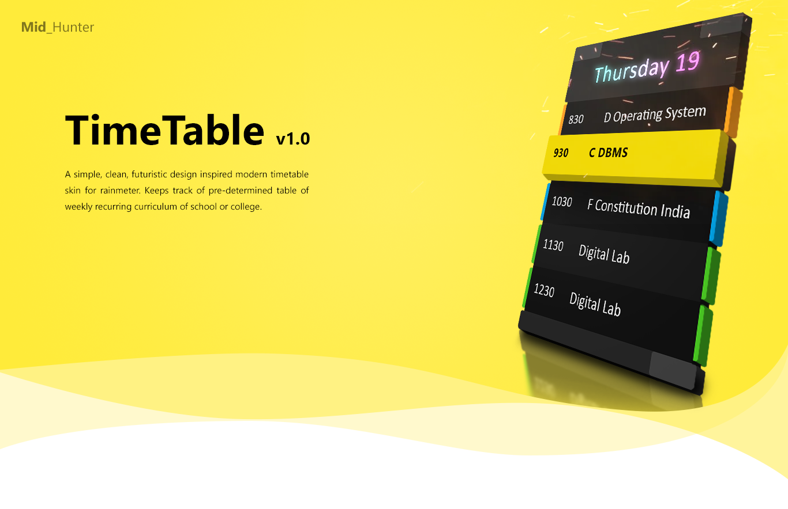

> This config needs rainmeter to work.

## Features
- Resizable skin for visiblity on different resolutions
- Highlights currently active subject
- Traverse through scheduled list of all each day
- Configurable settings ini (Settings GUI still in development)

 

<h3>Back Story</h3>
It was the year 2020. Due to the breakout of corona chan, the Institutions were forced to shutdown momentarily. That was the moment when online classes became popular among Educational Institutions which followed a fixed curriculum for each day of the week except for saturdays and sundays.
I was in need of a timetable to keep track of subjects whenever needed. Well, sure there are loads of android apps for this but flipping the phone open everytime is such an inconvinience so, It would be nice if the timetable could be integrated right into the desktop. So, I scoured through the internet in search of such thing. Bad luck, couldn't find any. Searched into the depths of archives of rainmeter skins too but, not quite what I visioned; a simple to follow timetable skin. After many weeks of desperate search, I knew what i'm looking for is imaginary... where are you now tun tu duun tun tu duun tun tu duun...
So, I accepted my fate and took the challenge to build what i seek myself. After infinite failed attempts, literal months and hours of reading documentation again and again to the point it became a part of myself, constant re-running and with the help of the good ol' print debugging friend, here it is... an unfinished yet, simple TimeTable skin. Just like what i wanted. Yay :D
